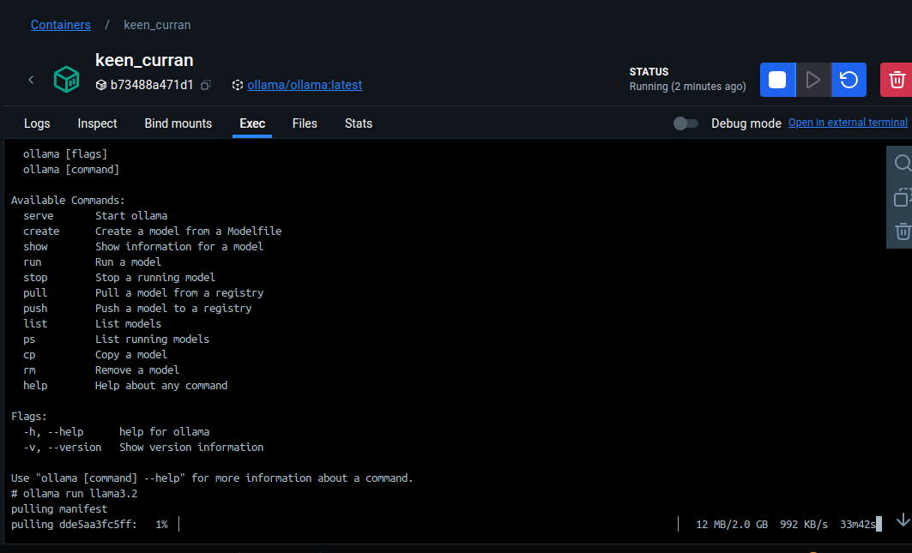
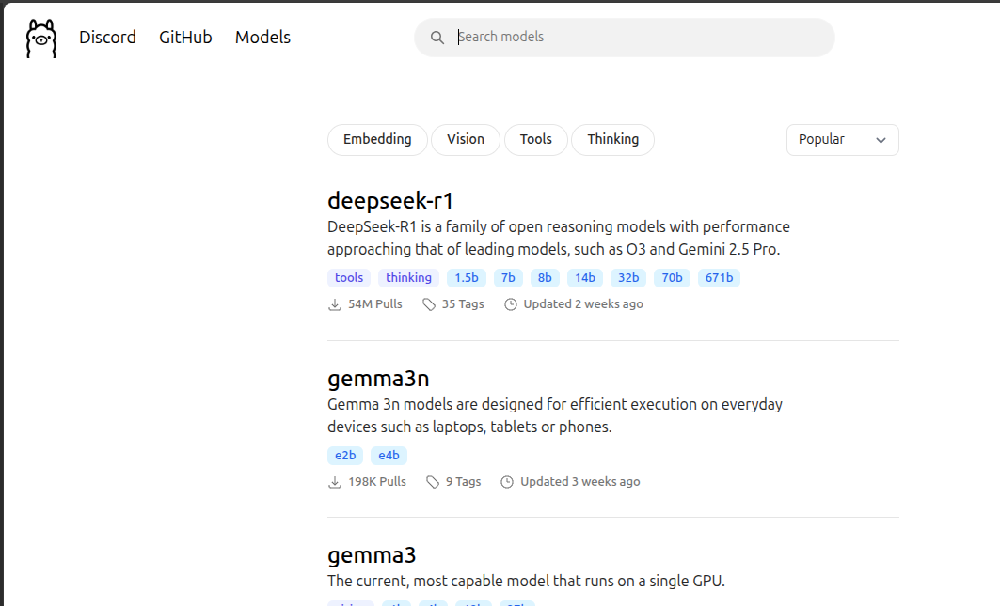
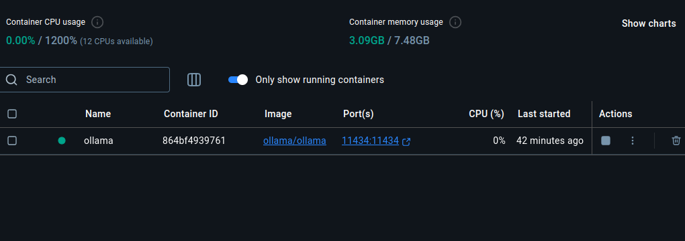
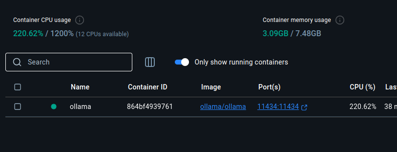
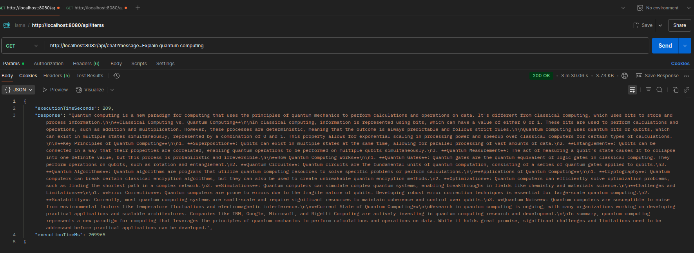
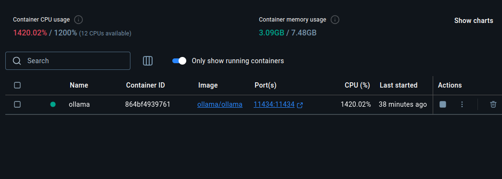

# Ollama Spring AI Integration with Docker

A Spring Boot application that integrates with Ollama AI models to provide chat functionality through REST APIs. This project demonstrates how to use Spring AI with Ollama models running in Docker containers.
Disclaimer, the models take some time to process the requests, So grab a cup of coffee or two as you wait for your responses.

## 📋 Table of Contents

- [Prerequisites](#🛠Prerequisites)
- [Docker Installation](#docker-installation)
- [Ollama Docker Setup](#ollama-docker-setup)
- [Model Management](#model-management)
- [Running the Application](#running-the-application)
- [API Usage](#api-usage)
- [Monitoring & Metrics](#monitoring--metrics)
- [Performance Considerations](#performance-considerations)
- [Troubleshooting](#troubleshooting)

## 🛠 Prerequisites

Before starting, ensure you have:
- Java 17 or higher
- Maven or Gradle
- Docker and Docker Compose
- At least 8GB RAM available for running models

## 🐳 Docker Installation

### Install Docker Desktop

**Windows/Mac/Linux:**
- Download Docker Desktop from [https://www.docker.com/products/docker-desktop/](https://www.docker.com/products/docker-desktop/)
- Follow the installation wizard
- Start Docker Desktop

**Verify Installation:**
```bash
docker --version
docker run hello-world
```

## 🚀 Ollama Docker Setup

### Important: Disable Local Ollama First

If you have Ollama installed locally, **disable it first** to avoid port conflicts:

**Windows:**
```powershell
# Stop Ollama service
net stop ollama
# Or disable from Services manager
```

**Mac/Linux:**
```bash
# Stop Ollama process
pkill ollama
# Or if running as service
sudo systemctl stop ollama
```

### Pull and Run Ollama Docker Container

1. **Pull the Ollama Docker image:**
```bash
docker pull ollama/ollama
```

2. **Run Ollama container:**
```bash
# Basic run command
docker run -d -v ollama:/root/.ollama -p 11434:11434 --name ollama ollama/ollama

# For better performance with GPU support (if available)
docker run -d --gpus=all -v ollama:/root/.ollama -p 11434:11434 --name ollama ollama/ollama
```

3. **Verify Ollama is running:**
```bash
# Check container status
docker ps

# Test Ollama API
curl http://localhost:11434/api/version
```

Expected response:
```json
{"version":"0.9.x"}
```

## 📦 Model Management

### Download Models

Access the running container to pull models:

```bash
# Enter the container
docker exec -it ollama ollama pull llama3.2

# Alternative: Pull multiple models
docker exec -it ollama ollama pull llama2
docker exec -it ollama ollama pull codellama
docker exec -it ollama ollama pull mistral
```

### List Available Models

```bash
# List downloaded models
docker exec -it ollama ollama list
```

### Remove Models (if needed)

```bash
# Remove a specific model
docker exec -it ollama ollama rm llama3.2
```
### Alternatively you could access the exec section in your docker desktop under the container
- Run the commands to run, pull install etc the models in docker.

### Model Sizes and Requirements

| Model | Size | RAM Required | Performance |
|-------|------|--------------|-------------|
| llama3.2 | ~2GB | 4GB | Fast, good quality |
| llama2 | ~3.8GB | 8GB | High quality |
| codellama | ~3.8GB | 8GB | Code-focused |
| mistral | ~4.1GB | 8GB | Balanced performance |
### Avalable Models
[**Ollama Models**](https://ollama.com/search)

## 🏃‍♂️ Running the Application

### 1. Configure Application Properties

Update your `application.yml`:

```yaml
spring:
  ai:
    ollama:
      base-url: http://localhost:11434  # Ollama Docker container URL
      chat:
        options:
          model: llama3.2  # Model name you downloaded
          temperature: 0.7
          top-p: 1.0
      embedding:
        model: nomic-embed-text # model for embeddings

server:
  port: 8082

logging:
  level:
    com.javaguy.ollama: INFO #replace javaguy with how you have named your dirs
    org.springframework.ai: DEBUG
```

### 2. Start the Spring Boot Application

```bash
# Using Maven
./mvnw spring-boot:run

# Using Gradle
./gradlew bootRun

# Or run the JAR
java -jar target/ollama-spring-ai-0.0.1-SNAPSHOT.jar
```

### 3. Verify Application Startup

Check the logs for successful Ollama connection:
```
INFO  c.j.ollama.ChatController - Chat request received
INFO  c.j.ollama.ChatController - Chat response sent in 1250 ms
```

## 🔧 API Usage

### Chat Endpoint

**Default Request (uses predefined Java technologies question):**
```bash
curl "http://localhost:8082/api/chat"
```

**Custom Message:**
```bash
curl "http://localhost:8082/api/chat?message=Explain Spring Boot in simple terms"
```

**Response Format:**
```json
{
  "response": "Spring Boot is a framework that simplifies...",
  "executionTimeMs": 1250,
  "executionTimeSeconds": 1.25
}
```

### Example Requests

```bash
# Technical question
curl "http://localhost:8082/api/chat?message=What are the benefits of microservices architecture?"

# Code explanation
curl "http://localhost:8082/api/chat?message=Explain this Java code: public static void main(String[] args)"

# Default Java technologies question (built into the controller)
curl "http://localhost:8082/api/chat"
```

## 📊 Monitoring & Metrics

### Ollama API Endpoints

**Check Ollama Status:**
```bash
curl http://localhost:11434/api/version
```

**List Running Models:**
```bash
curl http://localhost:11434/api/ps
```

**Model Information:**
```bash
curl http://localhost:11434/api/show -d '{"name": "llama3.2"}'
```

**Health Check:**
```bash
curl http://localhost:11434/api/tags
```

### Docker Container Monitoring

```bash
# View container logs
docker logs ollama

# Monitor resource usage
docker stats ollama

# Container information
docker inspect ollama
```

### Application Monitoring

The application provides execution time metrics in each response:
- `executionTimeMs`: Response time in milliseconds
- `executionTimeSeconds`: Response time in seconds

Monitor these values to track performance.

### Recommendations:

- **Development**: Use Docker for consistency and easy setup
- **Production**: Consider local installation for better performance
- **Team Environment**: Docker for standardized environments
- **CI/CD**: Docker for reproducible builds

### Performance Optimization

1. **Allocate sufficient memory to Docker:**
   ```bash
   # Increase Docker memory limit to 8GB+ in Docker Desktop settings
   ```

2. **Use GPU acceleration (if available):**
   ```bash
   docker run -d --gpus=all -v ollama:/root/.ollama -p 11434:11434 --name ollama ollama/ollama
   ```

3. **Optimize JVM settings:**
   ```bash
   java -Xmx4g -Xms2g -jar your-app.jar
   ```

## 🔧 Troubleshooting

### Common Issues

1. **Port 11434 already in use:**
   ```bash
   # Check what's using the port
   lsof -i :11434
   # Kill local Ollama process
   pkill ollama
   ```

2. **Container won't start:**
   ```bash
   # Check Docker logs
   docker logs ollama
   # Remove and recreate container
   docker rm -f ollama
   docker run -d -v ollama:/root/.ollama -p 11434:11434 --name ollama ollama/ollama
   ```

3. **Model not found error:**
   ```bash
   # Verify model is downloaded
   docker exec -it ollama ollama list
   # Pull the model if missing
   docker exec -it ollama ollama pull llama3.2
   ```

4. **Slow responses:**
    - Increase Docker memory allocation
    - Close unnecessary applications
    - Consider using a smaller model
    - Check system resources with `docker stats`

5. **Connection refused:**
   ```bash
   # Verify Ollama is running
   curl http://localhost:11434/api/version
   # Check application.yml configuration
   # Verify port mapping in Docker
   ```

### Debug Commands

```bash
# Check if Docker container is running
docker ps | grep ollama

# View detailed container info
docker inspect ollama

# Access container shell
docker exec -it ollama /bin/bash

# Test Ollama directly
docker exec -it ollama ollama run llama3.2
```

## 📸 Screenshots
- shows ollama running

- First seconds of making the user request

- Response after querying the model

- Memory consumption when processing the request


Please try it out on your own and share the speeds and memory consumption of each query.
## 🤝 Contributing

1. Fork the repository
2. Create a feature branch
3. Commit your changes
4. Push to the branch
5. Create a Pull Request

## 📄 License

This project is licensed under the MIT License - see the [LICENSE](LICENSE) file for details.

